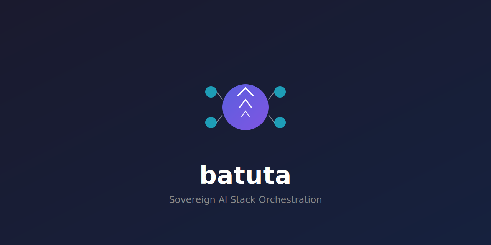

<div align="center">

<p align="center">
  
</p>

<h1 align="center">batuta</h1>

<p align="center">
  <b>Sovereign AI orchestration — autonomous agents, ML serving, code analysis, and transpilation in pure Rust</b>
</p>

<p align="center">
  <a href="https://github.com/paiml/batuta/actions/workflows/ci.yml"></a>
  <a href="https://crates.io/crates/batuta"></a>
  <a href="https://docs.rs/batuta"></a>
  <a href="https://paiml.github.io/batuta/"></a>
  <a href="https://opensource.org/licenses/MIT"></a>
</p>

</div>

---

## What It Does

Batuta is the CLI for the **Sovereign AI Stack** — a pure-Rust ecosystem for privacy-preserving ML infrastructure. Install it and immediately get:

```bash
# Analyze any codebase for quality, bugs, and technical debt
batuta analyze --tdg .
batuta bug-hunter analyze .
batuta falsify .

# Ask questions about the stack and get code examples
batuta oracle "How do I serve a Llama model locally?"

# Serve models with an OpenAI-compatible API
batuta serve ./model.gguf --port 8080

# Run autonomous agents (requires --features agents)
batuta agent run --manifest agent.toml --prompt "Summarize this codebase"
```

## Installation

```bash
cargo install batuta
```

For the autonomous agent runtime:

```bash
cargo install batuta --features agents
```

## Quick Start

### 1. Analyze a project

```bash
batuta analyze --tdg .
```

Output:
```
📊 Analysis Results
  Files: 440 total, 98,000 lines
  Languages: Rust (95%), TOML (3%), Markdown (2%)
  TDG Score: 98.4 (Grade: A+)
```

### 2. Hunt for bugs

```bash
batuta bug-hunter analyze .
```

Finds unwraps, panics, unsafe blocks, error swallowing, and 20+ fault patterns across your codebase.

### 3. Query the stack oracle

```bash
batuta oracle "How do I train a random forest?"
```

Returns component recommendations with working code examples and test companions.

### 4. Serve a model

```bash
batuta serve ./model.gguf --port 8080
```

Starts an OpenAI-compatible server at `http://localhost:8080/v1/chat/completions`.

## Features

- **Code Analysis**: TDG scoring, bug hunting, Popperian falsification testing
- **Oracle Queries**: Natural language queries with RAG-based documentation search
- **Model Serving**: OpenAI-compatible endpoints with privacy tiers (Sovereign/Private/Standard)
- **Autonomous Agents**: Perceive-reason-act loop with 16 formal contract invariants (`--features agents`)
- **Stack Orchestration**: Version drift detection, publish-status, release pipelines for 15+ crates
- **Transpilation**: Python/Shell/C to Rust conversion via depyler/bashrs/decy
- **Playbooks**: Deterministic YAML pipelines with BLAKE3 content-addressed caching

## Agent Runtime

The agent runtime (`--features agents`) provides a full autonomous agent loop:

```bash
# Run with a single prompt
batuta agent run --manifest agent.toml --prompt "Analyze this code for security issues"

# Interactive chat
batuta agent chat --manifest agent.toml --stream

# Multi-agent fan-out
batuta agent pool --manifest agent1.toml --manifest agent2.toml --prompt "Review this PR"
```

Agents are configured via TOML manifests with capability-gated tools (shell, filesystem, network, browser, RAG, MCP), privacy enforcement, and circuit-breaker guards.

See the [Agent Runtime Book Chapter](https://paiml.github.io/batuta/part3/agent-runtime.html) for details.

## Stack Components

```
┌─────────────────────────────────────────────────────────────┐
│                    batuta v0.7.3                             │
│                 (Orchestration Layer)                        │
├─────────────────────────────────────────────────────────────┤
│     realizar v0.8        │         pacha v0.2                │
│   (Inference Engine)     │      (Model Registry)             │
├──────────────────────────┴──────────────────────────────────┤
│   aprender v0.27   │  entrenar v0.7  │  alimentar v0.2      │
│    (ML Algorithms)  │    (Training)   │   (Data Loading)     │
├─────────────────────────────────────────────────────────────┤
│   trueno v0.16     │  repartir v2.0  │   renacer v0.10      │
│ (SIMD/GPU Compute)  │  (Distributed)  │  (Syscall Tracing)  │
└─────────────────────────────────────────────────────────────┘
```

| Component | Latest | Description |
|-----------|--------|-------------|
| [trueno](https://crates.io/crates/trueno) | 0.16 | SIMD/GPU compute primitives (AVX2/AVX-512/NEON, wgpu) |
| [aprender](https://crates.io/crates/aprender) | 0.27 | ML algorithms: regression, trees, clustering, NAS |
| [entrenar](https://crates.io/crates/entrenar) | 0.7 | Training: autograd, LoRA/QLoRA, quantization |
| [realizar](https://crates.io/crates/realizar) | 0.8 | Inference engine for GGUF/SafeTensors/APR models |
| [pacha](https://crates.io/crates/pacha) | 0.2 | Model registry with Ed25519 signatures, encryption |
| [repartir](https://crates.io/crates/repartir) | 2.0 | Distributed compute (CPU/GPU/Remote executors) |
| [renacer](https://crates.io/crates/renacer) | 0.10 | Syscall tracing with semantic validation |
| [trueno-rag](https://crates.io/crates/trueno-rag) | 0.2 | RAG pipeline (chunking, BM25+vector, RRF) |
| [pmat](https://crates.io/crates/pmat) | latest | Project quality analysis and TDG scoring |

## CLI Reference

```
batuta analyze        Analyze project structure, languages, TDG score
batuta bug-hunter     Proactive bug hunting (fault patterns, mutation targets)
batuta falsify        Popperian falsification checklist
batuta oracle         Natural language queries about the Sovereign AI Stack
batuta serve          ML model serving (OpenAI-compatible API)
batuta agent          Autonomous agent runtime (--features agents)
batuta stack          Stack version management, drift detection
batuta playbook       Deterministic YAML pipeline runner
batuta transpile      Code transpilation (Python/Shell/C → Rust)
batuta hf             HuggingFace Hub integration
batuta pacha          Model registry operations (sign, verify, encrypt)
```

## Privacy Tiers

| Tier | Behavior | Use Case |
|------|----------|----------|
| **Sovereign** | Blocks ALL external API calls | Healthcare, Government |
| **Private** | VPC/dedicated endpoints only | Financial services |
| **Standard** | Public APIs allowed | General deployment |

## Development

```bash
git clone https://github.com/paiml/batuta.git
cd batuta

cargo build --release          # Build
cargo test --lib               # Unit tests (5,641 tests)
cargo clippy -- -D warnings    # Lint
make book                      # Build documentation
```

## Quality

- **5,641 tests**, 95%+ line coverage
- **TDG Score: 98.4 (A+)**
- Zero clippy warnings, zero SATD
- 16 formal contract invariants (design-by-contract)
- Pre-commit hooks with complexity gates

## MSRV

Minimum Supported Rust Version: **1.89**

## License

MIT License — see [LICENSE](LICENSE) for details.

## Documentation

- [The Batuta Book](https://paiml.github.io/batuta/) — Comprehensive guide
- [API Documentation](https://docs.rs/batuta) — Rust API reference
- [Sovereign AI Stack Book](https://paiml.github.io/sovereign-ai-stack-book/) — Full stack tutorial

---

**Batuta** — Orchestrating sovereign AI infrastructure.
