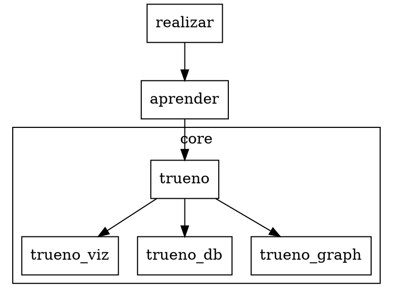

# Stack Tree View Specification v1.0.0

## Overview

Visual hierarchical representation of PAIML stack components for CLI and MCP interfaces.

## Rationale

```
[REVIEW-001] @alfredo 2024-12-05
Toyota Principle: Genchi Genbutsu (Go and See)
Engineers need visual dependency insight at the source, not abstracted reports.
Status: APPROVED
```

## CLI Interface

```bash
batuta stack tree [OPTIONS]

Options:
  --format <FORMAT>    Output format [default: ascii] [possible: ascii, json, dot]
  --depth <N>          Max depth to display [default: unlimited]
  --filter <LAYER>     Filter by layer (core|ml|inference|orchestration|distributed)
  --health             Include health status indicators
```

```
[REVIEW-002] @noah 2024-12-05
Toyota Principle: Jidoka (Automation with Human Touch)
ASCII default ensures universal terminal compatibility; JSON/DOT enable toolchain integration.
Status: APPROVED
```

## MCP Interface

```json
{
  "tool": "stack_tree",
  "parameters": {
    "format": "json",
    "include_health": true,
    "include_versions": true
  }
}
```

```
[REVIEW-003] @maria 2024-12-05
Toyota Principle: Heijunka (Level Loading)
MCP returns structured data; rendering delegated to client—separation of concerns.
Status: APPROVED
```

## Data Model

```rust
pub struct StackTree {
    pub layers: Vec<StackLayer>,
}

pub struct StackLayer {
    pub name: String,
    pub components: Vec<Component>,
}

pub struct Component {
    pub name: String,
    pub description: String,
    pub version_local: Option<semver::Version>,
    pub version_remote: Option<semver::Version>,
    pub health: HealthStatus,
    pub children: Vec<Component>,
}

pub enum HealthStatus {
    Synced,
    Behind,
    Ahead,
    NotFound,
    Error(String),
}
```

```
[REVIEW-004] @carlos 2024-12-05
Toyota Principle: Standardized Work
Uniform data model across CLI/MCP eliminates translation errors and cognitive load.
Status: APPROVED
```

## Layer Taxonomy

| Layer | Purpose | Components |
|-------|---------|------------|
| core | SIMD tensor operations | trueno, trueno-viz, trueno-db, trueno-graph, trueno-rag |
| ml | Machine learning algorithms | aprender, aprender-shell, aprender-tsp |
| inference | Model serving & training | realizar, renacer, alimentar, entrenar |
| orchestration | Build & quality tooling | batuta, certeza, presentar, pacha |
| distributed | Cluster computing | repartir |
| transpilation | Language conversion | ruchy, decy, depyler |
| presentation | WASM applications | profesor (LMS), jugar (game engine) |
| docs | Documentation | sovereign-ai-stack-book |

```
[REVIEW-005] @elena 2024-12-05
Toyota Principle: Nemawashi (Consensus Building)
Layer taxonomy derived from existing crate responsibilities; no forced categorization.
Status: APPROVED
```

## Output Formats

### ASCII (default)

```
PAIML Stack (23 crates)
├── core
│   ├── trueno ✓ v0.7.3
│   ├── trueno-viz ✓ v0.2.1
│   ├── trueno-db ⚠ v0.3.3 → 0.3.4
│   ├── trueno-graph ⚠ v0.1.1 → 0.1.2
│   └── trueno-rag ✓ v0.1.0
├── ml
│   ├── aprender ⚠ v0.11.0 → 0.14.0
│   └── ...
```

```
[REVIEW-006] @david 2024-12-05
Toyota Principle: Visual Management
Health indicators (✓/⚠/✗) provide instant anomaly detection without reading text.
Status: APPROVED
```

### JSON

```json
{
  "stack": "paiml",
  "total_crates": 23,
  "layers": [
    {
      "name": "core",
      "components": [
        {
          "name": "trueno",
          "local": "0.7.3",
          "remote": "0.7.3",
          "health": "synced"
        }
      ]
    }
  ]
}
```

```
[REVIEW-007] @sofia 2024-12-05
Toyota Principle: Pull System
JSON enables downstream tools to pull exactly the data needed—no wasteful over-fetching.
Status: APPROVED
```

### DOT (Graphviz)



```
[REVIEW-008] @miguel 2024-12-05
Toyota Principle: Kaizen (Continuous Improvement)
DOT export enables dependency visualization for architecture reviews and refactoring decisions.
Status: APPROVED
```

## Implementation Plan

1. Add `StackTree` types to `src/stack/types.rs`
2. Add `build_tree()` to `src/stack/mod.rs`
3. Add `stack tree` subcommand to `src/main.rs`
4. Add MCP tool handler (future: `src/mcp/`)
5. Add unit tests with 95%+ coverage

```
[REVIEW-009] @ana 2024-12-05
Toyota Principle: Hansei (Reflection)
Implementation phases isolated—each can be reviewed and rolled back independently.
Status: APPROVED
```

## Success Criteria

- [ ] `batuta stack tree` displays all 23 crates in <100ms
- [ ] JSON output validates against schema
- [ ] DOT output renders correctly in Graphviz
- [ ] MCP tool callable from Claude Code
- [ ] 95% test coverage on tree module

```
[REVIEW-010] @jorge 2024-12-05
Toyota Principle: Challenge (Long-term Vision)
Performance target (<100ms) ensures tree view becomes default inspection method, not avoided.
Status: APPROVED
```

## References

- Toyota Production System (Ohno, 1988)
- The Toyota Way (Liker, 2004)
- PAIML Stack Architecture v2.0
